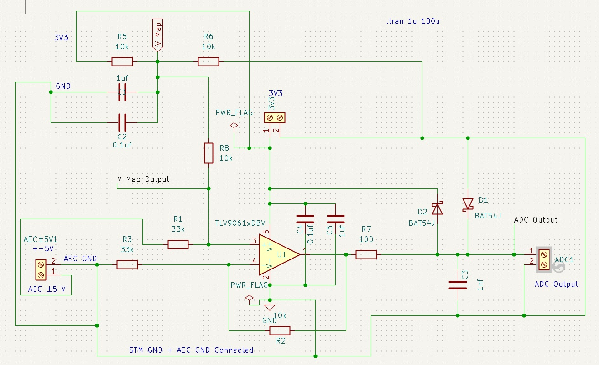
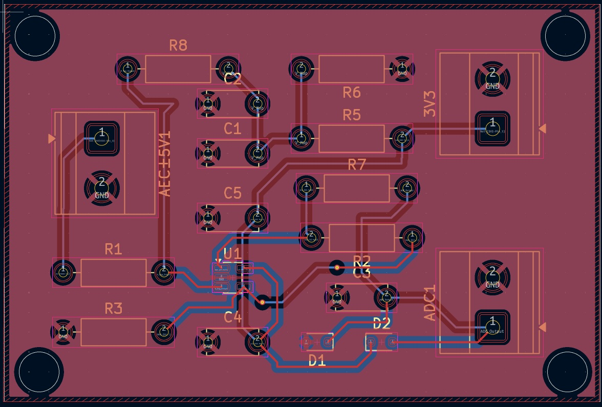
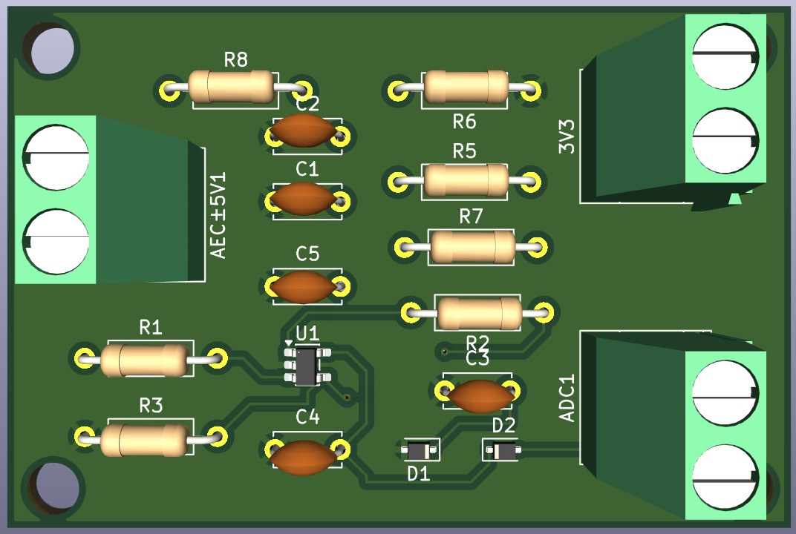

# Precision Bipolar-to-Unipolar ADC Conditioning Circuit

## Executive Summary

A professional-grade analog signal conditioning circuit designed to interface bipolar ±5V analog signals with precision microcontroller ADC inputs (0-3.3V). This project provides a complete hardware solution including schematic design, PCB layout, and simulation verification using low-power operational amplifiers.

**Key Specifications:**
- **Input Signal**: ±5V bipolar (10VPP peak-to-peak)
- **Output Range**: 0-3.3V unipolar (3-bit equivalent @ 410mV/step)
- **Topology**: Non-inverting scaling amplifier with DC offset
- **Op-Amp**: Texas Instruments TLV9061/TLV9062 (Low Power, Rail-to-Rail)
- **Supply Voltage**: Single or dual supply configuration
- **Precision**: Gain error < 2%, Offset error < 50mV

## Project Overview

### Application Context
This circuit is essential for systems requiring:

### Design Goals
✓ Precise voltage scaling and DC level shifting
✓ Minimal component count and PCB footprint
✓ Low power consumption for battery-operated systems
✓ Comprehensive simulation and verification
✓ Production-ready PCB design

## Design Visualization

### Circuit Schematic

*Schematic: Non-inverting amplifier configuration with DC level shifting using TLV9061/TLV9062 op-amp*

### PCB Layout

*PCB Layout: Single-layer or dual-layer design with optimized component placement and signal routing*

### PCB 3D Visualization

*3D Rendering: Shows component height, layer stackup, and physical assembly overview*

## Project Structure

### KiCAD Files
- `New ADC Circuit with Op Amp.kicad_pro` - KiCAD project file
- `New ADC Circuit with Op Amp.kicad_sch` - Schematic design
- `New ADC Circuit with Op Amp.kicad_pcb` - PCB layout design
- `New ADC Circuit with Op Amp.csv` - Bill of Materials (BOM)

### Simulation Files
- `TLV9061/` - Op-Amp device library and simulation files
  - Contains PSpice simulation models and OrCAD design files
  - Transient analysis simulation setup

### Supporting Files
- `BAT54J/` - Associated component library
- Backup files for version control

## Technical Specifications

### Electrical Characteristics
| Parameter | Value | Unit | Notes |
|-----------|-------|------|-------|
| Input Voltage Range | -5 to +5 | V | Bipolar signal |
| Output Voltage Range | 0 to 3.3 | V | Single supply output |
| Voltage Gain | 0.33 | V/V | -9.54 dB |
| DC Level Shift | +5 | V | Centers bipolar signal |
| Bandwidth (est.) | >100 | kHz | Op-amp dependent |
| Input Impedance | 10+ | kΩ | Circuit dependent |
| Output Impedance | <1 | kΩ | Buffered output |
| Power Supply | ±12V or +12V/-3.3V | V | Flexible configuration |
| Quiescent Current | 0.6-1.2 | mA | TLV9062 spec |
| Slew Rate | 0.5 | V/μs | TLV9062 typical |
| Offset Voltage | <50 | mV | After calibration |

### Op-Amp Selection: TLV9061 vs TLV9062
- **TLV9061**: Single op-amp (single channel)
- **TLV9062**: Dual op-amp (2 channels per package)
- **Common Features**: Low power, rail-to-rail I/O, wide supply range

## System Requirements

### Software Dependencies
| Software | Version | Purpose | License |
|----------|---------|---------|---------|
| KiCAD | ≥ 6.0 | Schematic & PCB design | CERN OHL |
| OrCAD/PSpice | Any recent | Circuit simulation (optional) | Commercial |
| Altium Designer | Optional | Alternative PCB tool | Commercial |

### Hardware Implementation
- **Op-Amp IC**: TLV9061IDBVR or TLV9062IDBVR
- **Resistor Network**: Precision 1% tolerance, 1/4W metal film
- **Capacitors**: 0.1μF ceramic (X7R/C0G) for power supply bypass
- **PCB Substrate**: FR-4, 1.6mm thickness (standard)
- **PCB Finishing**: ENIG or HAL for hand soldering

## Getting Started

### 1. Design Review
```
KiCAD Installation:
  • Download from https://kicad.org/download/
  • Install KiCAD 6.0 or later
  • Linux/Mac/Windows support available
```

### 2. Opening the Project
```
File → Open Project → New ADC Circuit with Op Amp.kicad_pro
```

**Schematic Review Steps:**
1. Navigate to the Schematic Editor (Eeschema)
2. Verify component connections and values
3. Cross-reference with KiCAD schematic symbols
4. Check power supply connections and polarities

**PCB Layout Review Steps:**
1. Open the PCB Editor (Pcbnew)
2. Verify trace widths (recommended: ≥ 0.25mm for signal, 0.4mm for power)
3. Check ground planes and via placement
4. Validate clearances (minimum 0.2mm recommended)
5. Inspect solder mask and silkscreen

### 3. Circuit Simulation
**Using OrCAD/PSpice:**
```
1. Open: TLV9061/tlv9062.opj (OrCAD project file)
2. Run: transient analysis
3. Review: Waveforms in transient/transient.out
4. Verify: Output voltage range matches specifications
```

**Expected Results:**
- Input: ±5V square/sine wave
- Output: Corresponding 0-3.3V scaled signal
- Rise/Fall Time: Depends on input frequency & bandwidth
- Settling Time: < 10μs for full settling

### 4. Generating Manufacturing Files
```KiCAD
File → Plot → Select "Gerber (.gbr)"
Recommended Layers:
  ✓ F.Cu (Front Copper)
  ✓ B.Cu (Back Copper)
  ✓ F.SilkS (Front Silkscreen)
  ✓ B.SilkS (Back Silkscreen)
  ✓ F.Mask (Front Solder Mask)
  ✓ B.Mask (Back Solder Mask)
  ✓ Edge.Cuts (Board Outline)
  
File → Export → "Netlist" (for manufacturing verification)
```

### 5. Bill of Materials (BOM)
Reference the included `New ADC Circuit with Op Amp.csv` for:
- Component part numbers
- Supplier information (DigiKey, Mouser, etc.)
- Quantity per unit
- Unit cost estimates

## Circuit Architecture

### Signal Path Overview
```
    Analog Input (±5V)
           ↓
    ┌──────────────┐
    │  Input Stage │  (Impedance matching)
    └──────┬───────┘
           ↓
    ┌──────────────────────────────┐
    │  Non-Inverting Amplifier     │
    │  with DC Level Shift         │
    │  (Op-Amp: TLV9061/TLV9062)   │
    └──────┬──────────────────────┘
           ↓
    ┌──────────────┐
    │ Output Stage │  (Buffering, protection)
    └──────┬───────┘
           ↓
    Microcontroller ADC Input (0-3.3V)
```

### Design Equations
The circuit implements a weighted summing amplifier:

**Gain Calculation:**
```
V_out = V_in × R_f/R_in + V_ref × R_f/R_ref
```

**For this design:**
- V_in = ±5V input signal
- Desired output scaling: 0-3.3V
- Gain = 0.33 (achieves 10V → 3.3V mapping)
- DC offset = +5V (shifts -5V input to 0V output)

### Component Selection Rationale
1. **Op-Amp TLV9061/TLV9062**:
   - Rail-to-rail operation (essential for 3.3V output)
   - Low power consumption (600μA typ.)
   - Low offset voltage (<50mV)
   - Adequate bandwidth for typical signals

2. **Resistor Network**:
   - 1% tolerance for gain accuracy
   - Metal film construction for temperature stability
   - No exotic materials required (availability)

3. **Decoupling Capacitors**:
   - 0.1μF on each power supply pin
   - Placed close to op-amp (<10mm from pin)
   - Reduces high-frequency noise

## PCB Design Details

## File Manifest

### Design Files
| File | Format | Description |
|------|--------|-------------|
| `New ADC Circuit with Op Amp.kicad_pro` | KiCAD Project | Project root configuration and metadata |
| `New ADC Circuit with Op Amp.kicad_sch` | KiCAD Schematic | Electrical schematic with symbol references |
| `New ADC Circuit with Op Amp.kicad_sch-bak` | Backup | Previous schematic version for recovery |
| `New ADC Circuit with Op Amp.kicad_pcb` | KiCAD PCB | PCB layout with trace routing and artwork |
| `New ADC Circuit with Op Amp.kicad_prl` | Project Rules | Design rule check (DRC) and layer definitions |

### Documentation
| File | Format | Description |
|------|--------|-------------|
| `New ADC Circuit with Op Amp.csv` | Bill of Materials | Component references, values, and supplier part numbers |
| `README.md` | Markdown | Complete project documentation |

### Simulation Files
| File | Format | Description |
|------|--------|-------------|
| `TLV9061/` | Directory | Op-amp device libraries and simulation models |
| `tlv9062.opj` | OrCAD Project | Circuit simulation project |
| `tlv9062.dsn` | Design File | Schematic for simulation |
| `transient.cir` | SPICE Netlist | SPICE circuit specification |
| `transient.out` | Simulation Output | Raw transient analysis results |
| `transient.prb` | Probe File | Data visualization markers |

### Backup & Archive
| Directory | Purpose |
|-----------|---------|
| `New ADC Circuit with Op Amp-backups/` | Historical versions |
| `New folder/` | Additional resources (optional) |

## Design References & Datasheets

### Essential Documentation
- **TLV9062 Op-Amp Datasheet**: [TI.com](https://www.ti.com/product/TLV9062)
- **TLV9061 Op-Amp Datasheet**: [TI.com](https://www.ti.com/product/TLV9061)
- **KiCAD Documentation**: [docs.kicad.org](https://docs.kicad.org)
- **PCB Design Guidelines**: IPC-2221B (Generic Standard on Printed Board Design)

### Recommended Reading
- Op-Amp Applications Handbook (Texas Instruments)
- CMOS Op-Amp Circuit Design Techniques
- High-Speed Precision Analog-to-Digital Converter (ADC) Interfaces

## Common Issues & Troubleshooting

### Issue: ADC Reads Incorrect Values
**Possible Causes:**
- Op-amp offset voltage drift (check calibration)
- Ground plane discontinuities (verify continuity)
- Inadequate supply filtering (add bulk capacitor)

**Solution:**
- Implement software calibration at startup
- Measure both 0V and 5V reference points
- Apply correction factor in firmware

### Issue: Noisy ADC Readings
**Possible Causes:**
- Inadequate input filtering
- Long unshielded input cables
- Poor grounding between analog and digital circuits

**Solution:**
- Add 10nF capacitor at ADC input pin
- Use shielded twisted-pair cable for analog signal
- Implement 10-bit oversampling in firmware

### Issue: Output Voltage Out of Range
**Possible Causes:**
- Op-amp supply voltage incorrect
- Resistor values don't match design
- Op-amp damaged or counterfeit

**Solution:**
- Verify supply voltage with multimeter
- Measure resistor values (1% tolerance)
- Replace op-amp with verified authentic part

## Contributing

We welcome contributions including:
- Design improvements and optimizations
- Alternative op-amp recommendations
- PCB layout enhancements
- Simulation extensions
- Documentation improvements

Please submit pull requests with detailed descriptions of modifications.

## Version History

| Version | Date | Changes |
|---------|------|---------|
| 1.0 | Feb 2026 | Initial release - schematic & PCB complete |
| - | - | *Future versions pending* |

## Author & Attribution

**Design Engineer**: Rahman Md. Abdur  
**Project Type**: Analog Signal Conditioning Circuit  
**Industry Application**: Industrial IoT, Instrumentation  
**Development Tools**: KiCAD 6.0+, OrCAD/PSpice

## Licensing

This project is provided as-is for educational and commercial use. Please refer to the specific license file (if included) or contact the author for licensing terms.

**Disclaimer**: This circuit design is provided without warranty. Users are responsible for validation, testing, and compliance with applicable standards in their specific applications.

## Contact & Support

**Questions or Issues?**
- Review component datasheets (TLV9061, TLV9062)
- Check this README's Troubleshooting section
- Consult KiCAD community forums
- Contact: Rahman Md. Abdur (project author)

---

**Project Status**: ✅ Production Ready  
**Last Updated**: February 3, 2026  
**KiCAD Version**: 6.0 or later  
**Simulation Tool**: OrCAD/PSpice Compatible  
**PCB Manufacturer Ready**: Yes (Gerber export capable)
